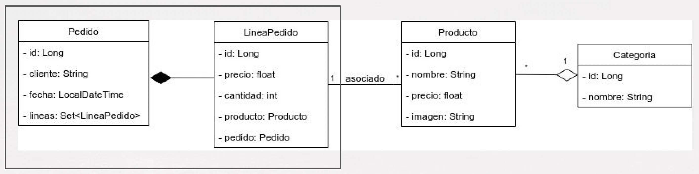

# Asociaciones

+ **Asociaciones Many-To-One**
+ **Asociaciones One-To-Many**
+ **Asociaciones Many-To-Many**


---

# Asociaciones many-to-one

## Modelo de datos
● No es lo mismo crear un controlador para una entidad sin
asociaciones, que para una entidad asociada con otras entidades.<br>
● Si la entidad en cuestión tiene asociaciones nos tenemos que
preguntar qué hacer:<br>
+ + Al listar todos
+ +  Al listar uno
+ +  Al crear/editar

## Asociación Many To One
● Suele ser una de las asociaciones más frecuente.<br>
● Diversas variantes (agregación, composición, …)<br>
● Asocia una instancia de una entidad con una varias instancias de
otra.<br>

## Asociación Many To One - ejemplos:

**Producto → Categoría:**<br>
un producto se asocia a una categoría,
pero una categoría puede estar asociada a muchos productos<br>
**Pedido → Cliente:** <br>
un pedido se asocia a un único cliente, pero un
cliente puede realizar muchos pedidos.<br>
**Población → Provincia:** <br>
una población pertenece a una provincia,
pero una provincia tiene muchas poblaciones.

## Modelo de Respuesta

Dada esta asociación, si nuestro controlador de obtener todos los
productos devuelve un `List`/`Page` o un `Producto`, obtendremos todos
los datos de `Producto` y de `Categoria`.

```json
{
    "id": 33,
    "nombre": "Mussels - Frozen",
    "precio": 95,
    "imagen": "http://dummyimage.com/206x125.bmp/cc0000/ffffff",
    "categoria": {
        "id": 1,
        "nombre": "Comida"
    }
}
```
Si a su vez, Categoria estuviera asociado con más objetos, nuestra
respuesta podría ser excesivamente grande.

```jason
{
    ...
    "categoria": {
        "id": 7,
        "nombre": "Refrescos"
        "categoriaPadre": {
            "id": 1,
            "nombre": "Bebidas"
        }
    }
}
```

## ¿Qué hacer entonces?
● Deberíamos diferenciar entre nuestras entidades y los objetos que
viajan en las peticiones/respuesta.<br>
● De hecho, para los expertos, no es buena práctica usar las entidades en
los controladores, para que transporten la información a
peticiones/respuestas.<br>
● Analizar, para cada petición, qué datos concretos queremos
enviar/recibir.<br>

### Petición GET
● **GET de TODOS/Consulta**<br>
 Normalmente no requiere de una representación completa del
objeto.
+ Evaluamos los atributos necesarios.
+ Seguramente, la mejor solución sería componer un Data
Transfer Object.
```json
{ 
    "id": 10, 
    "nombre": "Quail - Eggs, Fresh", 
    "categoria": "Bebida"
    "imagen": "http://dummyimage.com/133x134.bmp/dddddd/000000" }
```

● **GET por ID**<br>
+ Suele necesitar de una representación más completa del
objeto.
+ Con todo, es posible que no necesite todos los atributos de la
entidad (createdBy, createdAt, …)
+ Posiblemente, también necesitemos un DTO (diferente al
anterior)

● **Petición POST**<br>
Crear un nuevo recurso
+ El escenario puede ser variopinto
+ Depende mucho de los datos que estrictamente nos
proporciona el cliente al hacer la petición.
+ Puede que existan datos derivados (i.e.: nombreCompleto =
nombre + apellidos).
+ Lo más probable es que para una entidad con varias
asociaciones necesitemos un nuevo DTO.

● **Petición PUT**<br>
Editar un recurso existente
+ En la mayoría de situaciones, podremos usar o bien la entidad o
bien el DTO de la petición POST.
+ Si algunos atributos no son modificables, o el proceso de
modificación no es el habitual, posiblemente también
necesitemos un nuevo DTO.

● **Petición DELETE**<br>
Borrado de un recurso
+ No suele necesitar representación.
+ Si va bien, se suele devolver 204 No Content.
+ Si en alguna circunstancia, queremos devolver el recurso recién
borrado, podemos usar el DTO de GET por ID.

## En nuestro código
● Ya tenemos una asociación **many-to-one** de `Producto` a `Categoria`.<br>
● La forma de trasladar cada petición ya está implementada desde
lecciones anteriores:
+ GET Todos: Con un DTO
+ GET por ID: Objeto completo.
+ POST: Con un DTO
+ PUT: Con un DTO
+ DELETE: Tan solo con el ID<br>

● Se utilizan anotaciones especiales para definir contra qué columna en la tabla hace efectiva la relación entre ambas clases.
+ `@JoinComlumn`

**Producto**

```java
@Builder @Data @NoArgsConstructor @AllArgsConstructor
@Entity
public class Producto {

	@Id @GeneratedValue
	private Long id;
	
	private String nombre;
	private float precio;
	private String imagen;
    
	@ManyToOne
	@JoinColumn(name="categoria_id")
	private Categoria categoria;
}
```
**Categoria**

```java
@Data @NoArgsConstructor @AllArgsConstructor
@Entity
public class Categoria {

	@Id @GeneratedValue
	private Long id;
    
	private String nombre;
}
```

---

# Asociaciones One-To-Many

Suele ser complementaria a una asociación muchos a uno.<br>
## :warning:
+ Los expertos en JPA/Hibernate no recomiendan implementar
asociaciones **uno-a-muchos unidireccionales**, por el mal
rendimiento que provocan.<br>
Ejemplo: <br>
la asociación Producto ← Categoría generaría 3 tablas:
una para los productos, otra para categorías, y una tabla join.
+ Siempre es preferible el tratamiento **bidireccional**, que proporciona
un mejor rendimiento.

## Bidireccionalidad
● Recomendable para el tratamiento eficiente de la asociación.<br>
● :warning: Sin embargo, con **Lombok** podemos tener problemas de **recursión
infinita**.
● Para solucionarlo, necesitamos algunos elementos

modelo ejemplo:

Esta *composición* de Pedidos incluyen Lineas de Pedido (LineaPedido).


## Implementación

### 1
A nivel de entidad, con lombok:

:warning: para romper la referencia circular usamos:
`@EqualsAndHashCode.Exclude` y `@ToString.Exclude`.

:warning: a nivel de JSON usamos `@JsonManagedReference` y `@JsonBackReference`.

```java
// Anotaciones
public class Pedido {
    
 @EqualsAndHashCode.Exclude
 @ToString.Exclude
 @Builder.Default
 @OneToMany(mappedBy = "pedido",
    cascade = CascadeType.ALL,
    orphanRemoval = true)
 private Set<LineaPedido> lineas =
    new HashSet<>();
 
 // resto de atributos y métodos
}
```

```java
// Anotaciones
public class LineaPedido {
    
 @ManyToOne
 @JoinColumn(name = "pedido_id")
 private Pedido pedido;
 
 // resto de atributos y métodos
}
```
<br>

#### JsonManagedReference
○ la propiedad anotada es parte de una asociación bidireccional <br>
○ su función es el enlace *"padre"* (o *"reenvío"*).<br>
○ El tipo de valor (clase) de la propiedad debe tener una única
propiedad compatible anotada con `JsonBackReference`.<br>
○ Se serializa/deserializa con normalidad<br>
○ Es la referencia inversa coincidente que requiere un manejo
especial<br>
<br>

#### JsonBackReference
○ la propiedad anotada es parte de una asociación bidireccional<br>
○ su función es el enlace *"hijo"* (o *"atrás"*).<br>
○ La propiedad debe ser un `bean`, no una colección<br>
○ No se serializa<br>
○ En la deserialización, se crea un instancia dentro de la colección
`JsonManagedReference`.<br>
<br>

#### Uso de Lazy
En los parámetros de `@ManyToOne()` se puede usar `fetch-FetchType`.
+ `@ManyToOne(fetch = FetchType.LAZY)` evita una carga activa que traiga todos los elementos.

### 2 Configuración

#### 2.1 
Se agrega una clase: `MiConfiguracion` para habilitar JPA Auditing con `@EnableJpaAuditing`.
sirve para cuando se crea un pedido no se tenga que ingresar la fecha manualmente.

#### 2.2
Mas datos en la BD. y manejo de errores.

#### 2.3
Se agrega la anotación al modelo `@EntityListeners` para auditar.

En el caso de `Pedido` queda:

```java
@Data @Builder @NoArgsConstructor @AllArgsConstructor
@Entity
@EntityListeners(AuditingEntityListener.class)
public class Pedido {

    @Id
    @GeneratedValue
    private Long id;

    private String cliente;

    @CreatedDate
    private LocalDateTime fecha;
}
```

---

repetido:


## Evitar errores en asociaciones bidireccionales

Los expertos en JPA e Hibernate suelen recomendar tratar de forma bidireccional las asociaciones. De esta forma, se suele diseñar un mejor DDL, sobre todo para asociaciones one-to-many o many-to-many. Sin embargo, el uso de asociaciones bidirecionales con Lombok puede llegar a provocar algunos problemas de recursión infinita. Esta viene provocada por la propia bidireccionalidad.

Por ejemplo, un producto, asociado mediante many-to-one a una categoría, y esta a su vez asociada mediante one-to-many a un conjunto de productos. Cada uno de ellos, asociados, a su vez con la categoría, y así indefinidamente.

De nuevo, los expertos en JPA e Hibernate nos recomiendan dar un tratamiento especial a los métodos equals, hashCode y toString. Con todo, entrar en profundidad en esta materia queda fuera del alcance del curso.

En el ámbito de este curso, tenemos que dar una solución en dos niveles:

### Solución a nivel de Lombok

Para solucionar el problema a nivel de lombok (métodos equals, hashCode y toString) podemos usar algunas anotaciones para excluir determinados campos de estos métodos, y cortar así la recursividad.

Estas anotaciones son @EqualsAndHashCode.Exclude y @ToString.Exclude. Deberíamos incluirlas en uno de los lados de la asociación (lo normal suele ser en el lado mappedBy).

```java
// Anotaciones
public class LineaPedido {

    @ManyToOne
    @JoinColumn(name = "pedido_id")
    private Pedido pedido;

    // resto de atributos y métodos
}


// Anotaciones
public class Pedido {

    @EqualsAndHashCode.Exclude
    @ToString.Exclude
    @Builder.Default
    @OneToMany(mappedBy = "pedido", cascade = CascadeType.ALL, orphanRemoval = true)
    private Set<LineaPedido> lineas = new HashSet<>();

    // resto de atributos y métodos
}
```

### Solución a nivel de Jackson

Esta recursividad infinita también nos afecta en la transformación hacia/desde JSON. Jackson ofrece un par de anotaciones para solucionar el problema:

JsonManagedReference: se coloca a nivel de atributo (que forme parte de una asociación bidireccional). Este será el lado que se serialice con normalidad.
JsonBackReference: es la anotación complementaria a la anterior. Suele anotarse sobre un bean, y no una colección. Este lado no se serializa.

```java
// Anotaciones
public class LineaPedido {

    @JsonBackReference
    @ManyToOne
    @JoinColumn(name = "pedido_id")
    private Pedido pedido;

    // resto de atributos y métodos
}


// Anotaciones
public class Pedido {

    @JsonManagedReference
    @EqualsAndHashCode.Exclude
    @ToString.Exclude
    @Builder.Default
    @OneToMany(mappedBy = "pedido", cascade = CascadeType.ALL, orphanRemoval = true)
    private Set<LineaPedido> lineas = new HashSet<>();

    // resto de atributos y métodos
}
```


### Reto interesante

En esta lección nuestra aplicación ha crecido un poco (sobre todo en modelo). Se propone completar la parte del controlador, realizando algunas tareas de las lecciones anteriores.

1. Crear un DTO para las peticiones GET (todos los recursos) para Pedido y Línea de pedido. Se puede realizar la transformación en una nueva clase Converter, y usando Lombok.
2. Crear una vista con @JsonView para las peticiones GET por ID, de forma que en las líneas de venta, para el atributo producto, no se muestre el precio (lo tenemos en línea de venta), ni la imagen ni la categoría.
3. Crear la petición GET por ID en el controlador, siguiendo el ejemplo de las que ya hemos realizado anteriormente (Producto, Categoría).
4. Crear la petición POST para insertar un nuevo Pedido con sus Líneas de pedido. Para ello, vamos a crear un par de DTOs

- - NuevoPedidoDTO, con nombre y Set<NuevaLineaPedidoDTO>
- - NuevaLineaPedidoDTO, con el ID del producto y la cantidad.

El conversor de NuevaLineaPedidoDTO a LineaPedido tendrá que usar el servicio de producto, para transformar un ID de producto en un Producto.

5. Crear la petición PUT, que será muy similar a las POST.
6. Crear la petición DELETE, que será muy parecida a la de producto (con la asociación bidireccional y el borrado en cascada, al borrar un Pedido, se borrarán sus LineaPedido asociadas).